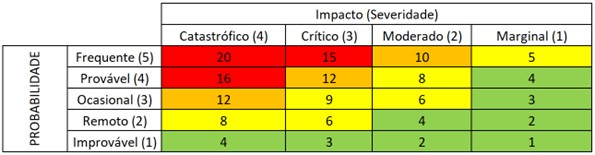

<h2 align="center">3.2.4 - 7. As an administrator, I want to identify and quantify the risks involved in the recommended solution  </h2>

### Risk Assessment Matrix

In order to analyze the probability of a given scenario occurring and its impact, the Risk Matrix is prepared. Each cell in the table is associated with a probability and an estimated impact.

Each cell is associated with the color corresponding to the risk it presents, according to the following table.

In the following table, the risks are identified, substantiated and classified.

